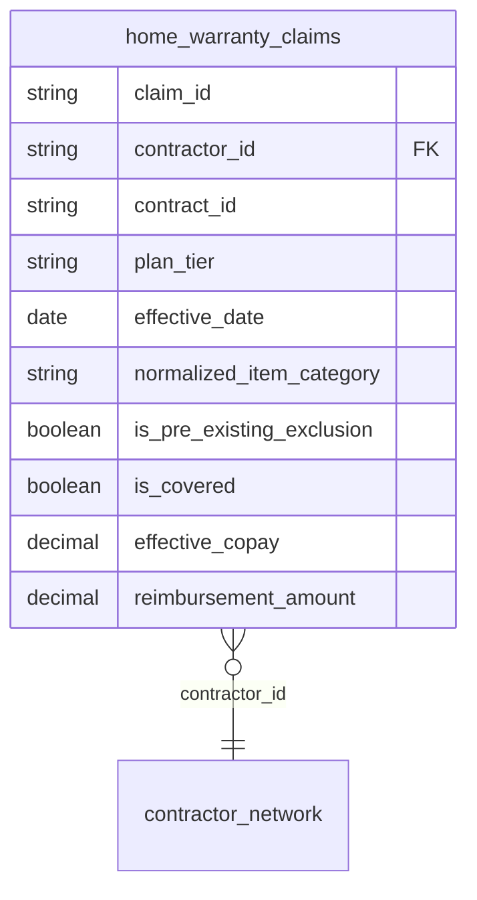

# Final Report — home_warranty_demo

**Status: frozen.** Scenario design, engine reconciliation, implementation,
verification, and the cold-context reconstruction test are all complete
and signed off. No further scenario changes, no new messiness, no engine
changes are motivated by this example. This document consolidates
everything already built and verified — it introduces no new work, no new
data, and no new design decisions.

---

## 1. Final directory inventory

```
examples/home_warranty_demo/
├── FINAL_REPORT.md                          this document
├── README.md                                narrative build log (superseded by this doc for reporting purposes; kept as-is)
├── structifact-home-warranty-handoff.md      the original design/reconciliation contract
├── business_memo.md                         the unedited business-rules memo
│
├── contracts.csv                            raw source (5 rows, incl. C-1001 duplicate)
├── claims.csv                               raw source (10 rows, incl. CL-07 blank contractor_id, CL-09/CL-10 A3-boundary pair)
├── coverage_rules.csv                       raw source (7 rows, incl. blank copay/cap cells)
├── contractor_network.csv                   raw source (5 rows)
│
├── contracts.yml                            minimal per-source ingestion schema
├── claims.yml                               minimal per-source ingestion schema (also used for validate-data)
├── coverage_rules.yml                       minimal per-source ingestion schema
├── contractor_network.yml                   minimal per-source ingestion schema (carries the contractor_id primary_key)
├── home_warranty_claims.yml                 the composite transformation spec (full text in §2)
│
└── generated/
    ├── home_warranty_claims.sql             DDL (CREATE TABLE), from `generate` default set
    ├── home_warranty_claims.yml             dbt-style YAML, from `generate` default set
    ├── home_warranty_claims_catalog.csv     minimal catalog, from `generate` default set
    ├── home_warranty_claims_model.sql       transformation SELECT, from `generate -g model`
    ├── home_warranty_claims.md              per-field docs, from `generate -g docs`
    ├── home_warranty_claims.mmd             Mermaid ERD, from `generate -g mermaid_erd`
    └── home_warranty.duckdb                 materialized database (9 rows in home_warranty_claims)
```

`tests/test_home_warranty_demo.py` (outside this directory, in the repo's
main test suite) provides automated regression coverage — 4 tests, all
passing, loading these real files (not hand-constructed IR objects)
against a real in-memory DuckDB.

---

## 2. Final `home_warranty_claims.yml`, in full

```yaml
# SYNTHETIC EXAMPLE (fictional company/data) — home_warranty_demo,
# Structifact's flagship complex example. Built from
# structifact-home-warranty-handoff.md in this folder, reconciled
# against the real engine (see README.md's "Reconciliation" section
# for what changed and why — every change below is a deliberate
# adaptation to the engine as it exists, not new engine capability).
#
# Grain: one output row per claim. Composite join against contract,
# coverage-rule, and contractor-network reference data. A missing
# coverage_rules match and an explicit covered=false row both mean
# "not covered" — treated as distinguishable causes with the same
# business outcome (see is_covered below).

dataset:
  name: home_warranty_claims
  description: >
    Per-claim coverage determination and reimbursement, joining claim
    records against contract, coverage-rule, and contractor-network
    reference data. A missing coverage_rules match and an explicit
    covered=false row both mean "not covered" — treated as
    distinguishable causes with the same business outcome (see
    is_covered below).

# claims is the fact table / primary source, not a joined-in one — it
# does not appear in `sources:` below (reconciliation finding: the
# proposed design omitted this and also listed claims under `sources:`,
# which would have left ModelGenerator defaulting to a primary source
# named "home_warranty_claims", which doesn't exist).
source_table: claims

sources:
  - name: contracts
    table: contracts
    dedup:
      partition_by: [contract_id]
      order_by: [record_entered_date desc]
      # Picks the more-recently-entered C-1001 row (start_date
      # 2025-03-01), not the one with the larger start_date value —
      # ordering by start_date itself would select the erroneous row.

  - name: coverage_rules
    table: coverage_rules

  - name: contractor_network
    table: contractor_network

joins:
  - source: contracts
    "on": "contracts.contract_id = claims.contract_id"
    type: left

  - source: coverage_rules
    # Reconciliation finding: ModelGenerator cannot resolve a
    # SELECT-list computed-field alias (normalized_item_category)
    # inside a JOIN...ON clause — JOIN...ON resolves during the FROM
    # clause, before the SELECT list exists (verified directly against
    # DuckDB: BinderException, "Referenced column ... not found in FROM
    # clause"). This inlines the identical CASE expression the
    # normalized_item_category field below also uses, rather than
    # referencing its alias — same raw-SQL trust model JoinSpec.on
    # already has, just written twice instead of aliased once.
    "on": >
      coverage_rules.plan_tier = contracts.plan_tier
      AND coverage_rules.item_category = (
        CASE WHEN claims.item_category = 'Water Heater' THEN 'WtrHtr'
        ELSE claims.item_category END
      )
    type: left

  - source: contractor_network
    "on": "contractor_network.contractor_id = claims.contractor_id"
    type: left

fields:
  - name: claim_id
    type: string
    # No `source:` — claims is the primary source (source_table above),
    # not a joined-in SourceRef, so it can't be named here (validation
    # error: "references unknown source 'claims'"). Fields with no
    # `source`/`source_column` set already default to the primary
    # source under their own name — today's existing single-source
    # behavior, unaffected by declaring sources/joins elsewhere.

  - name: contractor_id
    type: string
    nullable: false

  - name: contract_id
    type: string
    description: >
      The join key into contracts.contract_id — a real relationship,
      but deliberately not declared as a `constraints:` foreign_key
      below (see the note above `constraints:` for why: the raw
      contracts table is intentionally non-unique on this column
      before dedup, so DuckDB can't physically enforce it as a DDL
      FOREIGN KEY without contradicting the dedup scenario itself).

  - name: plan_tier
    type: string
    source: contracts

  - name: effective_date
    type: date
    source: contracts
    source_column: start_date
    description: >
      Mapped from the source system's own column name (start_date) —
      registrar's export was never renamed to match this schema.

  - name: normalized_item_category
    type: string
    computed: true
    # Single physical line, deliberately -- SQLGenerator renders a
    # computed field's expression as a one-line SQL comment above its
    # column definition; a YAML `>` fold with a trailing or embedded
    # newline (found the hard way, generating and reading the actual
    # DDL) breaks that comment mid-statement and produces invalid SQL.
    expression: "CASE WHEN claims.item_category = 'Water Heater' THEN 'WtrHtr' ELSE claims.item_category END"
    description: >
      claims.csv and coverage_rules.csv use different spellings for
      the same category (Water Heater vs. WtrHtr). This is a small,
      finite, explicitly-enumerated mapping — not similarity/fuzzy
      matching — since the category vocabulary is closed and known.
      The coverage_rules join above inlines this identical expression
      directly (rather than referencing this field's alias), since a
      JOIN condition cannot reference a computed SELECT-list alias —
      this field exists so the mapping is still visible in generated
      docs/output, not because the join itself depends on it.

  - name: is_pre_existing_exclusion
    type: boolean
    computed: true
    expression: "claims.claim_date <= effective_date + INTERVAL '30 days'"
    description: >
      True if filed within 30 days (inclusive of day 30) of the
      contract's effective date. Absolute exclusion regardless of
      plan tier or category, per company policy. References the
      effective_date field's own alias (declared earlier in this
      file), not contracts.start_date directly or a nonexistent
      contracts.effective_date column — DuckDB allows a later
      SELECT-list expression to reference an earlier one's alias
      within the same SELECT (a non-standard, DuckDB-specific
      convenience — see reimbursement_amount's note on why this
      example's field order matters).

  - name: is_covered
    type: boolean
    computed: true
    depends_on: [is_pre_existing_exclusion]
    expression: "NOT is_pre_existing_exclusion AND coverage_rules.covered IS NOT NULL AND coverage_rules.covered = TRUE"
    description: >
      False if the pre-existing exclusion applies. Also false if no
      coverage_rules row matched this tier/category at all
      (coverage_rules.covered IS NULL — no rule was ever written), or
      if the matched row explicitly states covered=false (a rule was
      written that excludes this combination). Both cases are
      deliberately treated identically in outcome, despite being
      different underlying situations. depends_on above documents
      this field's real dependency on is_pre_existing_exclusion, but
      is validated for referential integrity only — it does not
      itself drive generation order. What actually makes this
      expression resolve correctly is that is_pre_existing_exclusion
      is declared earlier in this file's fields list, combined with
      DuckDB's SELECT-list alias reuse (see that field's own
      description). Confirmed DuckDB-specific and non-portable to
      PostgreSQL — a known, already-logged limitation (see
      docs/FUTURE_WORK.md), not new to this example.

  - name: effective_copay
    type: decimal
    precision: 9
    scale: 2
    computed: true
    expression: "COALESCE(coverage_rules.copay_amount, 0)"
    description: >
      A blank copay_amount on a covered row means $0 copay, not "no
      rule" — that distinction is carried entirely by is_covered, not
      by this field.

  - name: reimbursement_amount
    type: decimal
    precision: 9
    scale: 2
    computed: true
    depends_on: [is_covered, effective_copay]
    expression: "CASE WHEN NOT is_covered THEN 0 ELSE LEAST(GREATEST(claims.claim_amount - effective_copay, 0), COALESCE(coverage_rules.coverage_cap, claims.claim_amount)) * CASE WHEN contractor_network.network_status = 'In-Network' THEN 1.0 ELSE 0.8 END END"
    description: >
      The coverage cap is applied BEFORE the non-network 80%
      multiplier, not after — the cap represents the plan's maximum
      covered amount; network status then determines what fraction of
      that covered amount is actually paid. This ordering is a
      deliberate resolution of an ambiguity the source business memo
      did not specify — the alternative ordering (multiplier first,
      then cap) produces different results whenever the cap actually
      binds. A blank coverage_cap means uncapped (COALESCE falls back
      to the claim amount itself as a no-op ceiling). Floored at zero
      via GREATEST() on the copay subtraction. Like is_covered above,
      depends_on documents the real dependency on is_covered and
      effective_copay but doesn't drive ordering itself — both are
      declared earlier in this file's fields list, which is what
      actually makes the DuckDB-specific alias reuse work here.

# A contract_id -> contracts.contract_id foreign_key constraint was
# proposed here but is deliberately omitted: DuckDB requires an FK's
# target column to already carry a PRIMARY KEY/UNIQUE constraint, and
# the raw contracts table is intentionally non-unique on contract_id
# before dedup (Mess #2 — the whole point of the C-1001 duplicate).
# Enforcing this FK against the raw table would contradict the
# scenario itself; enforcing it against a deduplicated view is a real
# option but a materially bigger change than this example needs. The
# relationship is still fully real and documented (see contract_id's
# own field description and the dataset-level description above) —
# just not physically enforced by DDL. contractor_id's FK below has
# no such conflict (contractor_network.contractor_id is genuinely
# unique in the raw data), so it's kept and physically enforced.
constraints:
  - type: foreign_key
    columns: [contractor_id]
    target_table: contractor_network
    target_column: contractor_id
```

---

## 3. Actual verified DuckDB output (all 9 materialized rows)

Re-queried fresh against `generated/home_warranty.duckdb` while assembling
this report (not carried over from an earlier run, and not hand-recalculated)
via:

```sql
SELECT * FROM home_warranty_claims ORDER BY claim_id;
```

Columns: `claim_id, contractor_id, contract_id, plan_tier, effective_date,
normalized_item_category, is_pre_existing_exclusion, is_covered,
effective_copay, reimbursement_amount`

```
('CL-01', 'K-200', 'C-1001', 'Standard', 2025-03-01, 'HVAC',       False, True,  75.000,  775.000)
('CL-02', 'K-201', 'C-1002', 'Basic',    2024-11-01, 'Electrical', False, False, 0.000,   0.000)
('CL-03', 'K-202', 'C-1003', 'Premium',  2025-01-10, 'WtrHtr',     False, True,  50.000,  1150.000)
('CL-04', 'K-203', 'C-1004', 'Standard', 2025-05-01, 'Plumbing',   False, True,  50.000,  320.000)
('CL-05', 'K-204', 'C-1001', 'Standard', 2025-03-01, 'Appliance',  False, True,  0.000,   220.000)
('CL-06', 'K-201', 'C-1002', 'Basic',    2024-11-01, 'HVAC',       False, True,  100.000, 480.000)
('CL-08', 'K-203', 'C-1002', 'Basic',    2024-11-01, 'Plumbing',   False, False, 0.000,   0.000)
('CL-09', 'K-200', 'C-1004', 'Standard', 2025-05-01, 'HVAC',       True,  False, 75.000,  0.000)
('CL-10', 'K-200', 'C-1004', 'Standard', 2025-05-01, 'HVAC',       False, True,  75.000,  525.000)

row count: 9
```

`CL-07` is intentionally absent — see §7, discrepancy #6.

All 9 values match the handoff's Section 8 expectations exactly, including
the two boundary claims added to exercise A3 (day 30 inclusive-excluded;
day 31 covered).

---

## 4. Actual `validate-data` output for CL-07 (verbatim)

Command:

```
$ structifact validate-data examples/home_warranty_demo/claims.yml examples/home_warranty_demo/claims.csv
```

Output (re-run fresh while assembling this report):

```
✓ Loaded schema: claims
✓ Loaded data: 10 rows

✗ 1 issue(s) found

Required-field violations:
  - contractor_id is blank at data row 7
```

---

## 5. Generated artifacts and their locations

| Artifact | Command | Location |
|---|---|---|
| Schema DDL | `structifact generate home_warranty_claims.yml` (default set) | `generated/home_warranty_claims.sql` |
| dbt-style YAML | `structifact generate home_warranty_claims.yml` (default set) | `generated/home_warranty_claims.yml` |
| Minimal catalog | `structifact generate home_warranty_claims.yml` (default set) | `generated/home_warranty_claims_catalog.csv` |
| Transformation model SQL | `structifact generate home_warranty_claims.yml -g model` | `generated/home_warranty_claims_model.sql` |
| Per-field docs | `structifact generate home_warranty_claims.yml -g docs` | `generated/home_warranty_claims.md` |
| Mermaid ERD | `structifact generate home_warranty_claims.yml -g mermaid_erd` | `generated/home_warranty_claims.mmd` |
| Materialized database | `structifact execute --engine duckdb --materialize` | `generated/home_warranty.duckdb` |

**Schema DDL** (`generated/home_warranty_claims.sql`):

```sql
CREATE TABLE home_warranty_claims (
    claim_id TEXT,
    contractor_id TEXT NOT NULL,
    contract_id TEXT,
    plan_tier TEXT,
    effective_date DATE,
    -- computed: normalized_item_category = CASE WHEN claims.item_category = 'Water Heater' THEN 'WtrHtr' ELSE claims.item_category END,
    normalized_item_category TEXT,
    -- computed: is_pre_existing_exclusion = claims.claim_date <= effective_date + INTERVAL '30 days',
    is_pre_existing_exclusion BOOLEAN,
    -- computed: is_covered = NOT is_pre_existing_exclusion AND coverage_rules.covered IS NOT NULL AND coverage_rules.covered = TRUE,
    is_covered BOOLEAN,
    -- computed: effective_copay = COALESCE(coverage_rules.copay_amount, 0),
    effective_copay DECIMAL,
    -- computed: reimbursement_amount = CASE WHEN NOT is_covered THEN 0 ELSE LEAST(GREATEST(claims.claim_amount - effective_copay, 0), COALESCE(coverage_rules.coverage_cap, claims.claim_amount)) * CASE WHEN contractor_network.network_status = 'In-Network' THEN 1.0 ELSE 0.8 END END,
    reimbursement_amount DECIMAL,
    FOREIGN KEY (contractor_id) REFERENCES contractor_network (contractor_id)
);
```

**Transformation model SQL** (`generated/home_warranty_claims_model.sql`):

```sql
with

contracts as (
    select *
    from (
        select *,
            row_number() over (
                partition by contract_id
                order by record_entered_date desc
            ) as rn
        from contracts
    ) t
    where rn = 1
),

coverage_rules as (
    select *
    from coverage_rules
),

contractor_network as (
    select *
    from contractor_network
),

final as (

    select
        claims.claim_id as claim_id,
        claims.contractor_id as contractor_id,
        claims.contract_id as contract_id,
        contracts.plan_tier as plan_tier,
        contracts.start_date as effective_date,
        CASE WHEN claims.item_category = 'Water Heater' THEN 'WtrHtr' ELSE claims.item_category END as normalized_item_category,
        claims.claim_date <= effective_date + INTERVAL '30 days' as is_pre_existing_exclusion,
        NOT is_pre_existing_exclusion AND coverage_rules.covered IS NOT NULL AND coverage_rules.covered = TRUE as is_covered,
        COALESCE(coverage_rules.copay_amount, 0) as effective_copay,
        CASE WHEN NOT is_covered THEN 0 ELSE LEAST(GREATEST(claims.claim_amount - effective_copay, 0), COALESCE(coverage_rules.coverage_cap, claims.claim_amount)) * CASE WHEN contractor_network.network_status = 'In-Network' THEN 1.0 ELSE 0.8 END END as reimbursement_amount

    from claims
    left join contracts
        on contracts.contract_id = claims.contract_id
    left join coverage_rules
        on coverage_rules.plan_tier = contracts.plan_tier AND coverage_rules.item_category = (
  CASE WHEN claims.item_category = 'Water Heater' THEN 'WtrHtr'
  ELSE claims.item_category END
)

    left join contractor_network
        on contractor_network.contractor_id = claims.contractor_id

)

select * from final;
```

**Mermaid ERD** (`generated/home_warranty_claims.mmd`):



Note the `coverage_rules` relationship does not appear as an ERD line — expected
(it's a computed join condition, not a `ConstraintSpec`), and the `contracts`
relationship also does not appear, per §7 discrepancy #5 (that FK was dropped
entirely, not merely unrendered).

Per-field docs (`generated/home_warranty_claims.md`) are reproduced in full
in §6 below, as read by the cold-context reconstruction agent.

---

## 6. Cold reconstruction test — full verbatim report

A genuinely fresh agent instance, with no prior context of this project or
conversation, was given only two files: `home_warranty_claims.yml` and
`generated/home_warranty_claims.md`. It was barred from reading any other
file (raw CSVs, SQL, the handoff document, this conversation). It answered
9 cold questions and self-classified each answer. Reproduced below exactly
as it wrote it — no paraphrasing, no summarizing.

### Classification table

| # | Question | Classification |
|---|---|---|
| 1 | CL-06 reimbursement, cap order | Reconstructed with uncertainty |
| 2 | CL-05 blank copay | Clearly reconstructed |
| 3 | Premium/HVAC blank cap | Clearly reconstructed |
| 4 | Day-30 boundary | Clearly reconstructed |
| 5 | CL-02 (no rule row) | Clearly reconstructed |
| 6 | CL-08 (explicit covered=FALSE) | Clearly reconstructed |
| 7 | CL-03 Water Heater→WtrHtr | Reconstructed with uncertainty |
| 8 | C-1001 dedup | Clearly reconstructed |
| 9 | Full transformation narrative | Clearly reconstructed |

### Full verbatim report

> I read only the two specified files: `home_warranty_claims.yml` and `generated/home_warranty_claims.md`. No other files were opened. Below are the 9 answers followed by self-classification for each.
>
> ## 1. CL-06 reimbursement (Basic, HVAC, $900 claim, $100 copay, $600 cap, non-network)
>
> **(a) Answer:** Assuming this claim is covered (the question's given copay/cap values imply a matched, covered coverage_rules row — the two files don't contain CL-06's actual `is_covered` value since that lives in claims.csv/coverage_rules.csv, which I wasn't allowed to open), the `reimbursement_amount` expression is:
> `LEAST(GREATEST(claim_amount - effective_copay, 0), COALESCE(coverage_cap, claim_amount)) * (network_status='In-Network' ? 1.0 : 0.8)`
> = LEAST(GREATEST(900-100,0)=800, 600) = 600, then × 0.8 (non-network) = **$480**.
> The coverage cap is applied **before** the non-network adjustment — this is explicit in the description: "The coverage cap is applied BEFORE the non-network 80% multiplier, not after — the cap represents the plan's maximum covered amount; network status then determines what fraction of that covered amount is actually paid."
>
> **(b) Classification:** Reconstructed with uncertainty
> **(c) Note:** The cap-before-multiplier ordering and arithmetic are explicit and unambiguous in the YAML; the uncertainty is only that these two files never confirm CL-06's actual `is_covered` status — I had to assume it from the question's framing rather than from text in the files.
>
> ## 2. CL-05 blank copay_amount (Standard/Appliance)
>
> **(a) Answer:** The copay is **$0**. `effective_copay` = `COALESCE(coverage_rules.copay_amount, 0)`, and the description states directly: "A blank copay_amount on a covered row means $0 copay, not 'no rule' — that distinction is carried entirely by is_covered, not by this field."
>
> **(b) Classification:** Clearly reconstructed
> **(c) Note:** Both the expression and the prose description explicitly and unambiguously state this.
>
> ## 3. Premium/HVAC coverage_cap blank
>
> **(a) Answer:** It means **uncapped**. `COALESCE(coverage_rules.coverage_cap, claims.claim_amount)` falls back to the claim's own amount, which acts as a no-op ceiling since `LEAST(x, claim_amount)` can never reduce `x` below the claim amount. Explicitly stated: "A blank coverage_cap means uncapped (COALESCE falls back to the claim amount itself as a no-op ceiling)."
>
> **(b) Classification:** Clearly reconstructed
> **(c) Note:** Stated verbatim in the description text.
>
> ## 4. Claim filed exactly 30 days after effective_date — pre-existing condition rule
>
> **(a) Answer:** **Excluded** (not covered). The expression is `claims.claim_date <= effective_date + INTERVAL '30 days'`, and the description says: "True if filed within 30 days (inclusive of day 30) of the contract's effective date." Day 30 is explicitly included, so `is_pre_existing_exclusion` = true, and `is_covered` requires `NOT is_pre_existing_exclusion`, so this claim would be excluded.
>
> **(b) Classification:** Clearly reconstructed
> **(c) Note:** The word "inclusive of day 30" directly and unambiguously resolves the boundary case.
>
> ## 5. CL-02 (Basic/Electrical), no coverage_rules row at all
>
> **(a) Answer:** **Not covered.** With no matching coverage_rules row, `coverage_rules.covered` is NULL after the left join. `is_covered` requires `coverage_rules.covered IS NOT NULL AND coverage_rules.covered = TRUE`, so a NULL fails that check. The doc states directly: "Also false if no coverage_rules row matched this tier/category at all (coverage_rules.covered IS NULL — no rule was ever written)."
>
> **(b) Classification:** Clearly reconstructed
> **(c) Note:** Explicitly described, matching the scenario given in the question.
>
> ## 6. CL-08 (Basic/Plumbing), coverage_rules covered=FALSE explicitly
>
> **(a) Answer:** **Not covered**, same outcome as CL-02 but for a **different underlying reason**. Here a rule exists and explicitly excludes this combination, versus CL-02 where no rule was ever written for that combination. The doc explicitly distinguishes them: "...or if the matched row explicitly states covered=false (a rule was written that excludes this combination). Both cases are deliberately treated identically in outcome, despite being different underlying situations." So the business result is identical but the cause is different.
>
> **(b) Classification:** Clearly reconstructed
> **(c) Note:** The doc explicitly calls out both cases and states they are "different underlying situations" despite identical outcome — this is as clear as it gets.
>
> ## 7. CL-03, item_category "Water Heater" vs. coverage_rules "WtrHtr"
>
> **(a) Answer:** The category-name mismatch itself does **not** block the lookup — the join condition inlines a normalization: `CASE WHEN claims.item_category = 'Water Heater' THEN 'WtrHtr' ELSE claims.item_category END`, joined against `coverage_rules.item_category`. So "Water Heater" is translated to "WtrHtr" before matching, and the doc confirms this is exactly why the mapping exists: "claims.csv and coverage_rules.csv use different spellings for the same category (Water Heater vs. WtrHtr)... a small, finite, explicitly-enumerated mapping." However, whether CL-03's coverage lookup *fully* succeeds also depends on whether `plan_tier` matches a coverage_rules row for that claim's contract — and I cannot confirm that from these two files alone, since actual row-level data lives in coverage_rules.csv/claims.csv, which I was not permitted to open.
>
> **(b) Classification:** Reconstructed with uncertainty
> **(c) Note:** The category-normalization mechanism is explicitly documented and clear; but confirming the *specific claim's* full join success also requires plan_tier data not present in these two files.
>
> ## 8. contracts.csv two rows for C-1001, different start_date
>
> **(a) Answer:** The row with the **most recently entered** `record_entered_date` is used — determined by the dedup config: `partition_by: [contract_id]`, `order_by: [record_entered_date desc]`. A comment explicitly resolves the ambiguity: "Picks the more-recently-entered C-1001 row (start_date 2025-03-01), not the one with the larger start_date value — ordering by start_date itself would select the erroneous row." So selection is driven by `record_entered_date`, not by which `start_date` value is larger/smaller.
>
> **(b) Classification:** Clearly reconstructed
> **(c) Note:** The YAML comment states the exact resolved value (2025-03-01) and explicitly warns against the naive interpretation (ordering by start_date), leaving no ambiguity.
>
> ## 9. Full transformation from raw claim to final reimbursement_amount, in own words (no SQL read)
>
> **(a) Answer:**
> 1. Start from `claims` as the primary/fact table (`source_table: claims`), one output row per claim.
> 2. Left-join `contracts` (after deduplicating so only one row per `contract_id` survives, keeping the most-recently-entered row) on `contracts.contract_id = claims.contract_id`, pulling in `plan_tier` and `effective_date` (renamed from the source's `start_date` column).
> 3. Left-join `coverage_rules` on a match of `plan_tier` plus a normalized `item_category` (mapping "Water Heater" → "WtrHtr", otherwise unchanged), pulling in `covered`, `copay_amount`, and `coverage_cap` for that tier/category combination.
> 4. Left-join `contractor_network` on `contractor_id`, pulling in `network_status`.
> 5. Compute `normalized_item_category` — a display-only copy of the same category-mapping expression used in the coverage_rules join.
> 6. Compute `is_pre_existing_exclusion` — true if the claim's `claim_date` falls within 30 days (inclusive) of the contract's `effective_date`.
> 7. Compute `is_covered` — false if the pre-existing exclusion applies; false if no coverage_rules row matched at all; false if a matched row explicitly says `covered=false`; true only if a rule was matched, says covered=true, and the pre-existing exclusion doesn't apply.
> 8. Compute `effective_copay` — the matched `copay_amount`, treating a blank as $0.
> 9. Compute `reimbursement_amount` — if not covered, $0. Otherwise: subtract the copay from the claim amount, floor the result at $0, cap that at the coverage_cap (treating a blank cap as uncapped, i.e., capped at the claim amount itself as a no-op), then multiply by 1.0 if the contractor is in-network or 0.8 if not. The cap is applied before the network-status multiplier, by deliberate design choice (an ambiguity in the original business memo that was resolved in favor of "cap first, then reduce for out-of-network").
>
> **(b) Classification:** Clearly reconstructed
> **(c) Note:** Every step and its ordering (including the deliberately documented cap-before-multiplier resolution) is explicitly stated in the field descriptions/expressions — no external SQL was needed to reconstruct this narrative.
>
> ---
>
> ### Overall critical observation
>
> The documentation is unusually thorough for edge cases and deliberate design decisions (blank values, cap ordering, dedup tie-breaking, the two "not covered" causes) — nearly every question above was answerable with a direct quote. The one genuine gap is that the **generated markdown doc has no field-level or row-level data examples** (no sample values, no worked example of a specific claim ID), so any question anchored to a specific claim ID (CL-02, CL-03, CL-05, CL-06, CL-08) could only be answered by combining the YAML's *rules* with data values supplied in the question itself — the docs alone never confirm what those specific claims' actual field values are. That's a structural limitation of docs-generated-from-metadata-only, not a wording flaw, but it means the docs describe the *logic* precisely while leaving *data verification* entirely out of scope.

### Interpretation

Both "uncertain" classifications (Q1, Q6/Q7 in the numbering above — note
the agent's own numbering treats CL-08 as Q6 and Water Heater as Q7) stem
from the same, single, expected cause: the agent was given only metadata
and docs, deliberately with no data, and it correctly refused to assert a
specific claim's row-level outcome it could not confirm from those two
files. In both cases the underlying *business rule* was still quoted
verbatim, correctly, and confidently. This is not a documentation defect —
see the framing in §8, which was written precisely to distinguish these
two levels of claim.

---

## 7. Every engine discrepancy discovered

Two phases produced discrepancies: the pre-build reconciliation pass
(checking the handoff's proposed design against the real engine before
writing any spec file) and the build itself (discrepancies visible only by
actually generating and executing real artifacts). They're kept separate
here because they were found at genuinely different times, by genuinely
different methods (reading code + isolated DuckDB tests, vs. running the
real CLI end to end) — collapsing them into one undifferentiated list would
overstate how much was caught by review alone.

**A note on this section's framing, flagged per your instruction to surface
inconsistencies rather than smooth them over:** when this report was
requested, two items were named as if they were among "the 6 from the build
phase" — the computed-field-in-join gap and depends_on being
validation-only. Both were actually found during the *pre-build*
reconciliation pass (via direct, isolated DuckDB tests, before any spec
file existed), not newly discovered during implementation. They're listed
in §7a below, not §7b, to keep that distinction accurate. §7b's actual
build-phase discovery count is 6, as stated — just not the same 6.

### 7a. Pre-build reconciliation (7 items, checked before writing any spec)

| # | Item | Verdict |
|---|---|---|
| 1 | `FieldSpec.source_column` for header drift | Matches |
| 2 | Plain single-source `DedupRule` before join | Matches |
| 3 | Join `on` referencing a computed field's alias | **Genuine gap** — confirmed via direct DuckDB test: `JOIN...ON` resolves during the `FROM` clause, before the `SELECT` list (where a computed alias exists) is evaluated. No engine allows this; not a Structifact-specific bug. |
| 4 | Join `on` referencing an already-joined source's column | Matches — standard SQL, verified directly |
| 5 | `depends_on` producing computation ordering | **Needs adaptation** — `depends_on` does nothing at generation time (validated for referential integrity only); actual ordering comes from field declaration order plus DuckDB's non-standard SELECT-list alias reuse (verified directly; already logged in `docs/FUTURE_WORK.md` as failing on PostgreSQL) |
| 6 | Mixed date-format parsing | **Genuine gap** — confirmed via direct DuckDB test: implicit VARCHAR→DATE cast only accepts `YYYY-MM-DD` |
| 7 | `nullable: false` for the required-field check | Matches, with a scoping correction (needs its own minimal `claims.yml`, not the composite spec) |

Two additional findings surfaced during this same pre-build pass, before
any code was written:

- **Missing `source_table`** — the originally-proposed YAML never set
  `source_table: claims`, which would have defaulted `ModelGenerator`'s
  primary source to the dataset's own name (`home_warranty_claims`,
  nonexistent).
- **`execute --materialize` requires upstream tables to pre-exist** —
  it never creates or populates them itself.

### 7b. Discovered only during the actual build (6 items)

None of these were flagged by the pre-build reconciliation — each was
found only by generating real artifacts and executing them against real
data.

1. **The `source_table` fix needed a second half.** Beyond setting
   `source_table: claims` and dropping `claims` from `sources:`, running
   `structifact validate` also rejected `source: claims` on the `claim_id`/
   `contractor_id` field definitions — a field's `source` must name a
   joined-in `SourceRef`, never the primary source itself.

2. **`is_pre_existing_exclusion`'s expression referenced a column that
   doesn't exist.** The originally-proposed `contracts.effective_date` is
   neither a real physical column (the raw table only has `start_date`)
   nor a valid qualified reference to the `effective_date` *alias* (an
   alias can't be prefixed with a source name). Fixed by referencing the
   bare alias `effective_date` instead.

3. **A YAML formatting bug broke the generated DDL.** Three computed
   fields' `expression` values used YAML `>` folded block scalars with
   inconsistent internal indentation (and `>`'s default trailing newline)
   — both produce embedded newlines in the parsed string.
   `SQLGenerator` renders a computed field's expression as a single-line
   SQL comment; an embedded newline splits that comment mid-statement and
   produces a syntax error in the generated `CREATE TABLE`. Only visible
   by generating the actual DDL and reading it — `structifact generate`
   itself reports no error, since nothing validates the *content* of
   `expression`. Fixed by writing all three as genuinely single-line
   strings.

4. **`execute --data` doesn't coerce a blank CSV cell to SQL `NULL`, for
   any column type.** Confirmed on two different failure shapes from the
   same root cause: `coverage_rules.csv`'s blank `copay_amount`/
   `coverage_cap` cells load as literal empty strings, which a typed
   `DECIMAL` column can't accept (`Conversion Error`); `claims.csv`'s
   blank `contractor_id` on CL-07 also loads as `''`, not `NULL` —
   silently satisfying a `NOT NULL` check, then failing downstream
   instead, as a foreign-key violation. Adapted (not patched) by loading
   `coverage_rules` and `claims` via DuckDB's own `COPY ... NULLSTR ''`
   / `read_csv(..., nullstr='')` instead of `structifact execute --data`.
   `contracts` and `contractor_network` (no blank cells) still use
   `execute --data` directly, demonstrating that path working as
   designed on clean data.

5. **A `contract_id` foreign key can't be physically enforced against the
   raw `contracts` table.** DuckDB requires an FK's target column to
   already carry a `PRIMARY KEY`/`UNIQUE` constraint — but the raw
   `contracts` table is *deliberately* non-unique on `contract_id` before
   dedup (that's the entire point of Mess #2's duplicate `C-1001` row).
   Enforcing this FK against the raw table would contradict the scenario
   itself. Adapted by dropping this one `constraints:` entry (the
   relationship is still fully documented in `contract_id`'s own field
   description) while keeping `contractor_id → contractor_network`
   (physically valid, given a `primary_key` constraint added to
   `contractor_network.yml`).

6. **CL-07 can't cleanly reach the materialized composite table either
   way** — loaded as `''` it fails the FK check; loaded as real `NULL`
   it fails `claims.contractor_id`'s own `NOT NULL` constraint
   (correctly — it really is invalid data). This matches the handoff's
   own Section 8, which already anticipated CL-07 "is not expected to
   reach the transformation cleanly." Adapted by excluding CL-07 from
   the raw `claims` table used for materialization (the other 9 claims
   materialize and verify normally) while running `validate-data`
   separately against the full, unmodified `claims.csv` to catch it —
   the real, intended gate for this exact failure mode.

---

## 8. What this example demonstrates

> A reader can reconstruct the dataset's business semantics, including
> deliberate ambiguity resolutions and non-obvious transformation
> decisions, from the metadata and generated documentation without
> reading the generated SQL. Row-level computed results additionally
> require the source data.

The cold reconstruction test (§6) confirms the first sentence directly: 7
of 9 questions were answered as "Clearly reconstructed," quoting exact
metadata/docs text, with zero access to SQL. The remaining 2 were marked
"uncertain" for exactly the reason the second sentence names — the agent
correctly declined to assert a specific claim's outcome without the
underlying data, which it was deliberately not given. No question failed
because the *documentation itself* was unclear about a rule; every
business-logic question (cap ordering, blank-value semantics, the 30-day
boundary, the two distinct "not covered" causes, the dedup tie-break) was
answered confidently and correctly from text alone.

---

## 9. Confirmation: no engine primitives were added

Verified directly (`git status`, `git diff --stat -- structifact/`) while
assembling this report: **zero files under `structifact/` were modified
at any point during design, reconciliation, or implementation of this
example.** Every one of the discrepancies in §7 was resolved on the
example side:

- Inlined the `normalized_item_category` `CASE` expression directly into
  the `coverage_rules` join's `on:`, rather than referencing its alias.
- Pre-normalized `claims.csv`'s three US-format dates to `YYYY-MM-DD`.
- Dropped the one physically-unenforceable `contract_id` foreign key,
  keeping it as documentation only.
- Used DuckDB's own native `COPY ... NULLSTR` / `read_csv(...,
  nullstr=...)` to load `coverage_rules` and `claims`, instead of
  `structifact execute --data`.
- Excluded CL-07 from the materialization path, verified separately via
  `validate-data`.
- Rewrote three computed-field expressions as single-line strings to
  avoid the YAML folded-scalar newline leak.

Every genuine engine limitation found (§7a items 3, 5, 6; §7b items 3, 4,
5, 6) is documented as a current-state observation in this report and in
`home_warranty_claims.yml`'s own inline comments — not silently patched,
and not used to justify a change to `structifact/`. No UNION, no fuzzy/
probabilistic matching, and no expansion of the parked `DedupRule`
cross-join case were used anywhere in this build.
